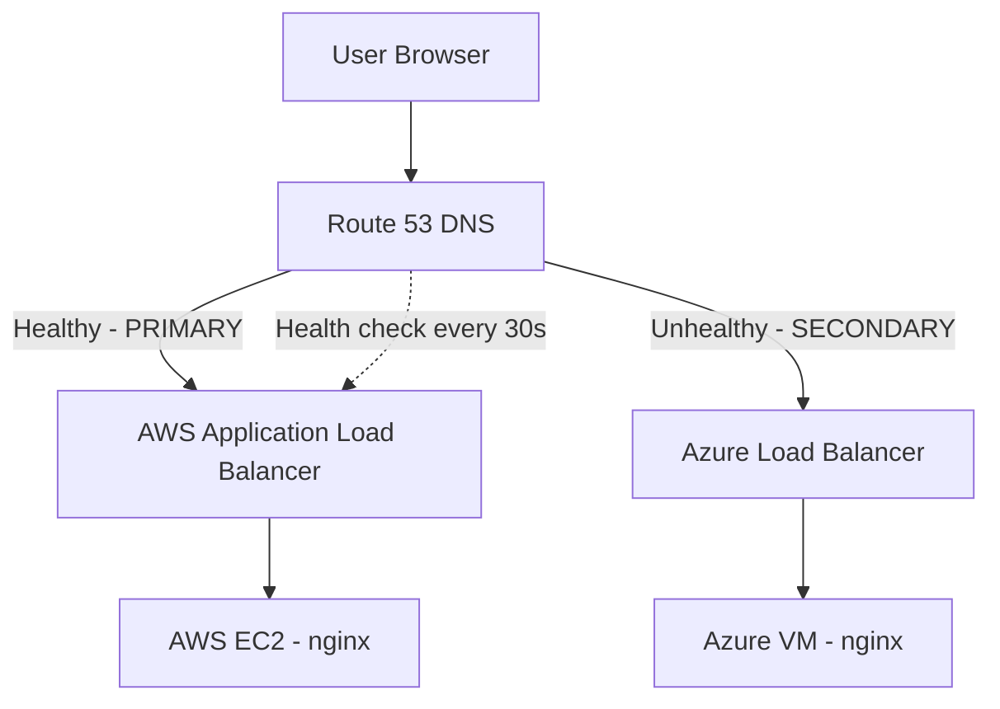

# Multi-Cloud Active-Passive Failover Lab

A beginner-friendly hands-on lab that deploys the same **Hello World** web app on **AWS** (active) and **Azure** (passive standby), with **Route 53** DNS failover between them.

## Architecture



### Traffic flow (normal)

1. User requests `http://app.yourdomain.com`
2. Route 53 resolves to the **AWS ALB** (PRIMARY record)
3. ALB forwards traffic to the **EC2 instance** running nginx
4. Page shows an orange **ACTIVE — AWS** badge

### Traffic flow (failover)

1. Route 53 health check hits `http://<alb-dns>/health` every 30 seconds
2. After **2 consecutive failures** (~60 seconds), AWS is marked unhealthy
3. Route 53 switches to the **SECONDARY** record → **Azure Load Balancer**
4. Page shows a blue **PASSIVE STANDBY — Azure** badge

## Prerequisites

| Tool | Purpose |
|------|---------|
| [Terraform](https://developer.hashicorp.com/terraform/install) ≥ 1.5 | Infrastructure deployment |
| [AWS CLI](https://aws.amazon.com/cli/) | Credentials + chaos testing |
| [Azure CLI](https://learn.microsoft.com/en-us/cli/azure/install-azure-cli) | Credentials + chaos testing |
| A domain in **Route 53** | DNS failover requires a hosted zone |

### Cloud credentials

```powershell
# AWS
aws configure
# or set AWS_ACCESS_KEY_ID / AWS_SECRET_ACCESS_KEY

# Azure
az login
az account set --subscription "<your-subscription-id>"
```

### Domain setup

You need a Route 53 hosted zone for your domain (e.g. `example.com`).

- **Existing zone:** Set `create_hosted_zone = false` and provide `hosted_zone_id` in `terraform.tfvars`.
- **New zone:** Set `create_hosted_zone = true`, run `terraform apply`, then update your registrar's nameservers using the `nameservers` output.

## Quick start

### Option A — GitHub Actions (recommended)

Deploy entirely from GitHub without a local `terraform apply`. See **[docs/GITHUB_ACTIONS.md](docs/GITHUB_ACTIONS.md)** for:

1. Creating the GitHub repo
2. Bootstrapping S3 remote state
3. Configuring secrets and variables
4. Running **plan / apply / destroy** from the Actions tab

### Option B — Local Terraform

```powershell
cd f:\Compsiprep\Project\Terraform

# 1. Bootstrap remote state (one time)
$env:TF_STATE_BUCKET = "your-unique-bucket-name"
.\scripts\bootstrap-backend.ps1
copy config\backend.hcl.example backend.hcl
# Edit backend.hcl with your bucket name

# 2. Configure variables
copy terraform.tfvars.example terraform.tfvars
# Edit terraform.tfvars with your domain and settings

# 3. Initialize and deploy
terraform init -backend-config=backend.hcl
terraform plan
terraform apply

# 4. Wait ~2-3 minutes for cloud-init to install nginx on both VMs

# 5. Verify each endpoint directly
terraform output aws_alb_url
terraform output azure_lb_url

# 6. Verify via Route 53
terraform output app_url
```

Open the `app_url` in your browser — you should see the **AWS** page.

## Project structure

```
Terraform/
├── .github/workflows/
│   └── terraform.yml          # GitHub Actions: plan / apply / destroy
├── config/
│   ├── backend.hcl.example    # S3 backend config template
│   └── lab.tfvars.example     # Lab variable reference for GitHub Variables
├── main.tf                    # Orchestrates modules + Route 53 failover
├── variables.tf
├── outputs.tf
├── providers.tf
├── versions.tf
├── terraform.tfvars.example
├── scripts/
│   ├── bootstrap-backend.ps1  # One-time S3 + DynamoDB for remote state
│   └── bootstrap-backend.sh
├── modules/
│   ├── aws-active/            # VPC, EC2, ALB, security groups
│   └── azure-passive/         # VNet, VM, Standard Load Balancer
└── docs/
    ├── GITHUB_ACTIONS.md      # CI/CD setup and run guide
    └── CHAOS_TEST.md          # Step-by-step outage simulation
```

## Chaos test (simulate AWS outage)

See [docs/CHAOS_TEST.md](docs/CHAOS_TEST.md) for detailed steps. Quick version:

### Option A — Stop nginx on EC2

```powershell
$instanceId = terraform output -raw chaos_test_aws_instance_id
aws ssm start-session --target $instanceId
# Inside the session:
sudo systemctl stop nginx
```

> EC2 needs the SSM agent and an IAM instance profile for SSM. If SSM isn't configured, use Option B.

### Option B — Block the security group (recommended)

```powershell
$sgId = terraform output -raw chaos_test_aws_security_group_id
aws ec2 revoke-security-group-ingress --group-id $sgId --protocol tcp --port 80 --source-group $sgId
```

This blocks ALB → EC2 traffic. The ALB health check fails, which causes the Route 53 health check to fail.

### Watch failover happen

1. Note the time you triggered the outage
2. Wait ~60 seconds (30s interval × 2 failures)
3. Refresh `app_url` — you should see the **Azure** page
4. Check health check status:

```powershell
$hcId = terraform output -raw route53_health_check_id
aws route53 get-health-check-status --health-check-id $hcId
```

### Restore AWS

```powershell
# Re-allow HTTP from ALB security group
$sgId = terraform output -raw chaos_test_aws_security_group_id
$albSgId = aws ec2 describe-security-groups --filters "Name=group-name,Values=failover-lab-alb-sg" --query "SecurityGroups[0].GroupId" --output text
aws ec2 authorize-security-group-ingress --group-id $sgId --protocol tcp --port 80 --source-group $albSgId
```

After AWS is healthy again, Route 53 will route traffic back to the PRIMARY (AWS) record.

## Cost estimate (lab)

| Resource | Approx. monthly cost |
|----------|---------------------|
| EC2 t3.micro | ~$8 (free tier eligible) |
| ALB | ~$16 + LCU |
| Azure B1s VM | ~$8 |
| Azure Standard LB | ~$18 |
| Route 53 hosted zone | $0.50 |
| Route 53 health check | $0.50 |

**Tip:** Run `terraform destroy` when you're done to avoid ongoing charges.

## Cleanup

```powershell
terraform destroy
```

## Troubleshooting

| Symptom | Fix |
|---------|-----|
| `app_url` shows connection error | Confirm nameservers point to Route 53; wait for DNS propagation |
| AWS page works, Azure direct URL fails | Wait for cloud-init (~3 min); check VM backend health in Azure portal |
| Failover doesn't trigger | Health check needs ~60s; verify with `aws route53 get-health-check-status` |
| Terraform Azure auth error | Run `az login` and set the correct subscription |

## What you'll learn

- End-to-end traffic flow: **DNS → load balancer → compute**
- **Active-passive** failover with Route 53 health checks
- Same app pattern on **two different clouds** (AWS ALB vs Azure LB)
- How to **simulate real outages** and observe automatic recovery
